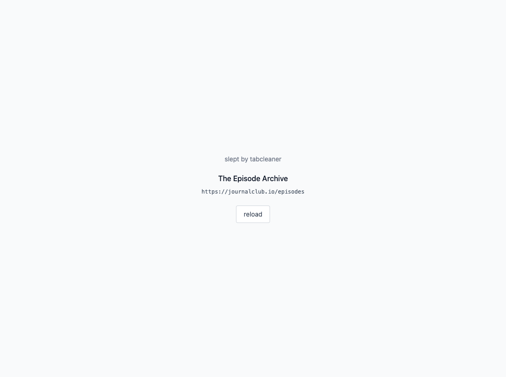
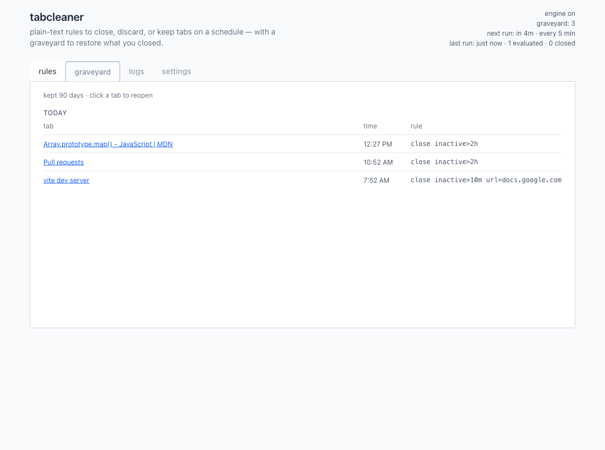

# tabcleaner

chrome extension: plain-text tab rules, scheduled cleanup, graveyard restore, dev logs.

open the dashboard from the toolbar icon. rules run on an alarm; you can also hit **run now**.

## screenshots

captured from the built extension in headed chromium (`npm run screenshots:readme`).

### rules

editor with sample rules from tests: `keep`, `close`, `discard`, `sleep`, plus `url=` and `inactive>`. one rule per line; engine toggle; save / run now.


### sleep

slept tabs show the original title and url (plain text). reload restores the page; nothing goes to graveyard.



### graveyard

closed tabs land here. click a title to restore. grouped by day with the rule that closed each tab.



### logs

plain-text dev log in storage — cycles, closes, sleeps, restores. not a per-tab audit trail.


### settings

evaluation interval and graveyard retention. saves immediately; interval change reschedules the alarm.


## setup

```bash
npm install
npm run build
```

load unpacked from `dist/` in chrome: extensions → developer mode → load unpacked → choose the `dist/` folder.

iterative builds: `npm run watch` rebuilds `dist/` on change; reload the extension after each build.

### playwright (e2e / screenshots only)

`test:e2e`, `verify`, and `screenshots:readme` load the extension in playwright’s chromium (headed). (this browser is separate from your daily chrome profile)

after `npm install`, run:

```bash
npx playwright install chromium
```

you do not need this to build the extension or load `dist/` in chrome.

## commands

| command | purpose |
| ------- | ------- |
| `npm run build` | production build to `dist/` |
| `npm test` | `lib/**` unit tests |
| `npm run test:ui` | vue component tests |
| `npm run test:e2e` | playwright + loaded extension (headed) |
| `npm run verify` | build + unit + ui + lint + e2e |
| `npm run screenshots:readme` | refresh `docs/screenshots/` for this file |

## license

MIT — see [LICENSE](LICENSE).
