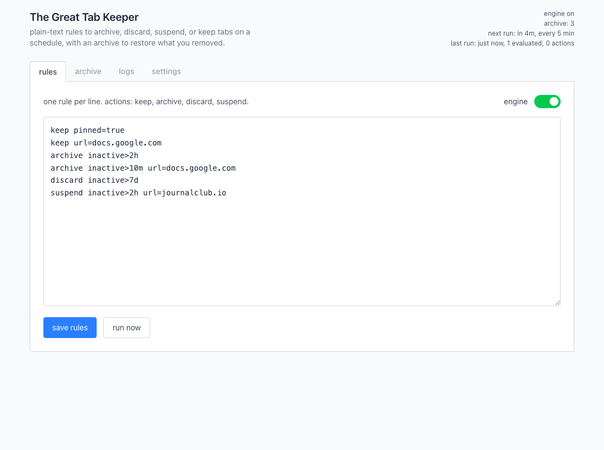
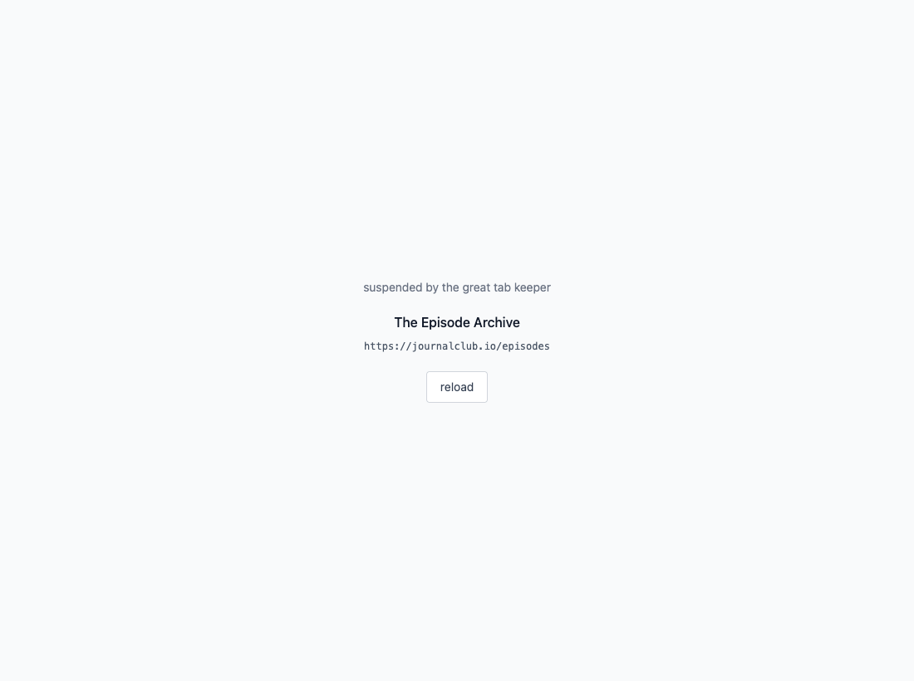
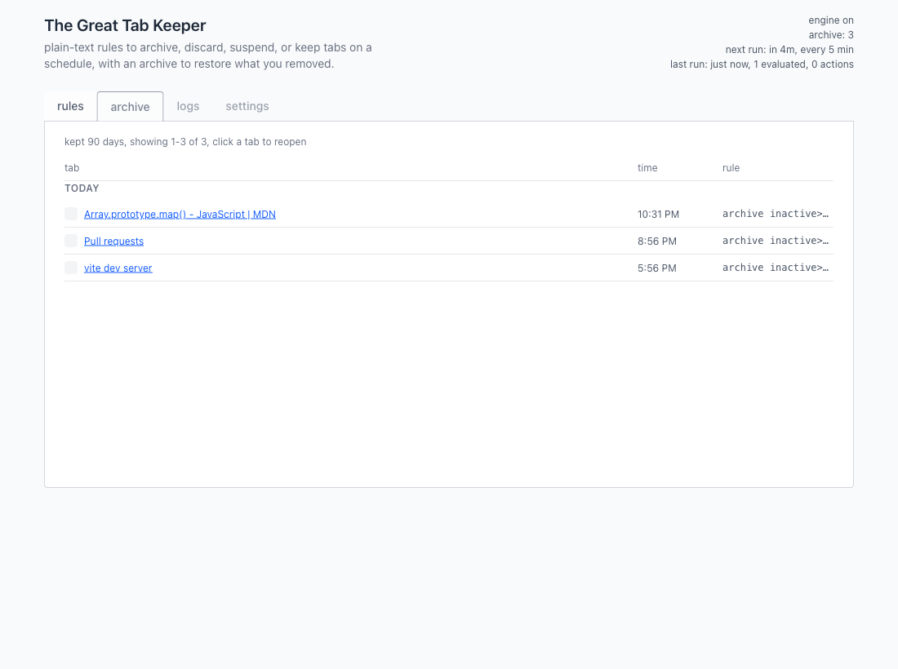
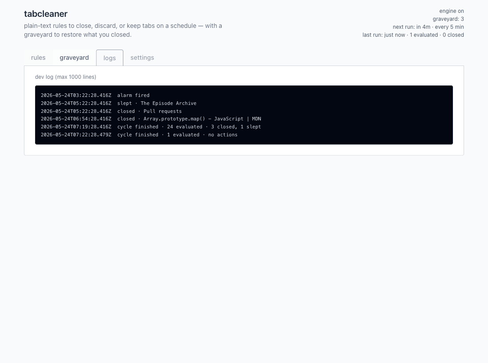
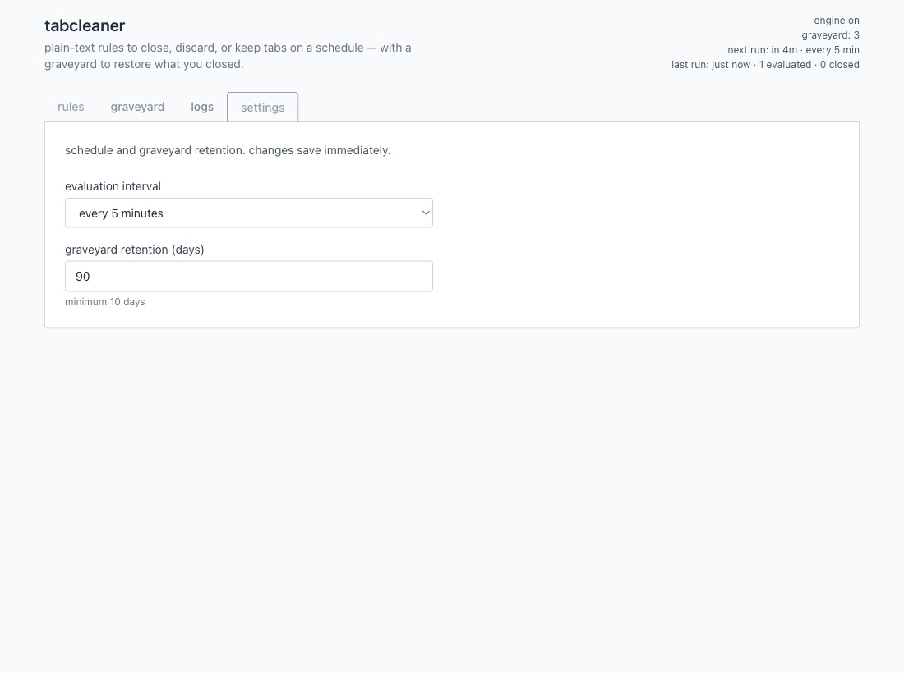

# The Great Tab Keeper


Reduce tab clutter with rules you control. Keep, archive, suspend, or discard tabs on a schedule.

Open the dashboard from the toolbar icon. Rules run automatically in the background every 5 minutes; you can also hit **run now**.

## How to Use This Extension

not published to the chrome web store yet. install from a [github release](https://github.com/mhtocs/the-great-tab-keeper/releases) zip or build locally (see [setup](#setup)).

### Install from a Release

1. open [releases](https://github.com/mhtocs/the-great-tab-keeper/releases) and download `the-great-tab-keeper-v<version>.zip` for the version you want.
2. unzip it anywhere (e.g. downloads). you get one folder; that's the extension.
3. in chrome, open **extensions**, turn on **developer mode**, click **load unpacked**, and select that unzipped folder (the folder itself, not the zip file).
4. pin or open **The Great Tab Keeper** from the toolbar to open the dashboard. set rules, save, and leave the engine on for scheduled cleanup (or use **run now**).

to update later, download a newer zip, remove the old unpacked extension in chrome, and load the new folder (or replace the folder contents and hit **reload** on the extension card).

### Build from Source

see [setup](#setup). after `npm run build`, use the same **load unpacked** step and choose the `dist` folder in the repo.

## Rules

plain-text lifecycle rules, one per line:

```txt
[action] [condition] ...
```

### Actions

| action | effect |
| ------ | ------ |
| `keep` | leave the tab alone |
| `archive` | close tab and save to archive (restore from the archive tab) |
| `discard` | close tab with no archive |
| `suspend` | lightweight placeholder page; reload restores the url |

### Conditions

| condition | meaning |
| --------- | ------- |
| `inactive>2h` | tab inactive for at least 2 hours (`m`, `h`, or `d`) |
| `url=example.com` | url contains the text, or use `*` / `?` globs (e.g. `url=*youtube.com*`) |
| `pinned=true\|false` | tab pinned state |
| `audible=true\|false` | tab playing audio |
| `active=true\|false` | tab is the active tab in its window |
| `suspended=true\|false` | tab is already on the suspend placeholder |

pinned, audible, and active tabs are skipped unless the matching rule sets that flag to `true`. when several rules match, the most specific wins.

### Examples

```txt
keep pinned=true
keep url=docs.google.com
archive inactive>2h
archive inactive>10m url=docs.google.com
discard url=*example.com* inactive>7d
suspend inactive>2h url=journalclub.io
```

## Screenshots

### Rules

rules editor with the reference panel and sample rules above.



### Suspend

suspended tabs show the original title and url (plain text). reload restores the page; nothing goes to archive.



### Archive

archived tabs land here. click a title to restore. grouped by day with the rule that archived each tab.



### Logs

dev log: cycles, archives, suspends, restores.



### Settings

evaluation interval and archive retention.



## Setup

```bash
npm install
npm run build          # output in ./dist/
```

```bash
npm test
npm run test:ui
npm run lint
npm run verify         # build + unit + ui + lint + e2e (e2e needs headed playwright)
```

iterative builds: `npm run watch` rebuilds `dist/` on change; reload the extension after each build.

load unpacked from `dist/` in chrome: open extensions, enable developer mode, load unpacked, and choose the `dist/` folder.

ci on push/pr runs `npm ci`, build, unit, ui, and lint (see `.github/workflows/ci.yml`). (e2e is local only, headed playwright + mv3)

### Playwright (E2E / Screenshots Only)

`test:e2e`, `verify`, and `screenshots:readme` load the extension in playwright’s chromium (headed). (this browser is separate from your daily chrome profile)

after `npm install`, run:

```bash
npx playwright install chromium
```

you do not need this to build the extension or load `dist/` in chrome.

### Releases

[published releases](https://github.com/mhtocs/the-great-tab-keeper/releases) include a zip of `dist/` for load unpacked in chrome.

tag must match `package.json` version (e.g. tag `v0.0.1` and `"version": "0.0.1"`):

```bash
git tag v0.0.1
git push origin v0.0.1
```

github actions builds, tests, and attaches `the-great-tab-keeper-v0.0.1.zip`.

## Commands

| command | purpose |
| ------- | ------- |
| `npm run build` | production build to `dist/` |
| `npm test` | `lib/**` unit tests |
| `npm run test:ui` | vue component tests |
| `npm run test:e2e` | playwright + loaded extension (headed) |
| `npm run verify` | build + unit + ui + lint + e2e |
| `npm run screenshots:readme` | refresh `docs/screenshots/` for this file |
| `./scripts/package-extension.sh` | zip `dist/` to `the-great-tab-keeper-v<version>.zip` |
